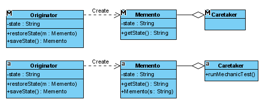

- Originator
- Caretaker
- Memento



```java
public class Originator {
    ...
    public Memento saveState() {				// <= save
		return new Memento(this.state);
	}

	public void restoreState(Memento memento) { // <= restore
		this.state = memento.getState();
	}
    ...

    public static class Memento {
        ...
```

```java
public class CarCaretaker {
    ...
        // do save
		Originator.Memento savedState = new Originator.Memento("");
		savedState = originator.saveState(); 
		
```
> savedState = <br>
> originator.saveState() <br>
> return new Memento(this.state)<br>
> this.state => Originator.state => "State2"


# Reference:
- Design Patterns and Best Practices in Java
- Java_notebook > Design_patterns
