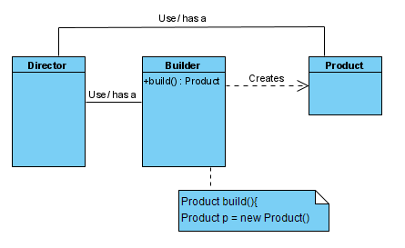

## Characteristic: 

```java
Product p = 
    ...
    .addA()
    .addB()
    .build(); // <=
```


- Director
- Builder
- Product

### Product

```java
public class Pizza {
	String name;
	List<String> toppings;
	
	void addToppings(List<String> toppings) { // <=
		this.toppings = toppings;
	}
    void bake() {
		...
	}
 
	void cut() {
		...
	}
    ...
    public void setName(String name) {
    ... }
}
```

### Builder
```java
public abstract class PizzaBuilder {
	String name;
	List<String> toppings = new ArrayList<String>();
	
    // for topping
	public abstract PizzaBuilder addCheese();
	public abstract PizzaBuilder addSauce();
    ...

	public Pizza build() {
		Pizza pizza = new Pizza(); // <= Pizza
		...
		pizza.addToppings(toppings);
		return pizza;
	}
}
```

```java
public class MeatPizzaBuilder extends PizzaBuilder {
    ...
	public PizzaBuilder addCheese() {
		this.toppings.add("mozzerella");
		return this;
	}
	public PizzaBuilder addSauce() {
		this.toppings.add("NY style sauce");
		return this;
	}
    ...
```

### Director

<br>

|veggie|meat|
|---|---|
|Sauce|Sauce|
|Cheese|Cheese|
|Olives||
|Tomatoes|Tomatoes|
|Sausage|Sausage|
||Pepperoni|
|||

<br>

```java
public static void main(String[] args) {
    PizzaBuilder meatBuilder = 
        new MeatPizzaBuilder();

    Pizza meat = meatBuilder
                    ...
                    .addCheese()
                    .addSausage()
                    ...
                    .build();
    ...
    meat.bake();
    ...

```

```java
Pizza veggie = veggieBuilder
				...
				.addOlives()
				.addTomatoes()
				.addSausage()
				.build();
```


<br>
<br>

# Reference
- Head First Design Patterns