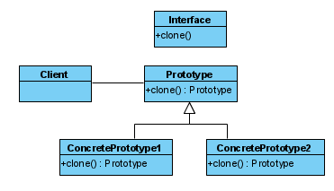

# Prototype



## Method 1 

```java
package com.fbtest.test_spring_boot.pr20210501.rect;

public class Rect implements Cloneable {
	private double h;
	private double w;
	
	public Rect() {}
	
	public Rect(double h, double w) {
		this.h = h;
		this.w = w;
	}
	
	public Rect clone() throws CloneNotSupportedException {
		return (Rect) super.clone();
	}
	public double getH() {
		return h;
	}
	public double getW() {
		return w;
	}
	public void setH(double h) {
		this.h = h;
	}
	public void setW(double w) {
		this.w = w;
	}
}
```

```java
package com.fbtest.test_spring_boot.pr20210501.rect;

import com.google.gson.Gson;

public class Client{
	public static void main(String [] args) 
			throws CloneNotSupportedException {
		Rect r1 = new Rect(2.0,3.0);
		Rect r2 =  r1.clone();
		System.out.println(new Gson().toJson(r2));
	}
}
```

## Method 2 ( abstract )

```java
package com.fbtest.test_spring_boot.pr20210501_2.rect2;

public abstract class Rect implements Cloneable {
	private double h;
	private double w;
	
	public Rect() {}
	
	public Rect(double h, double w) {
		this.h = h;
		this.w = w;
	}
	
	public abstract Rect clone() throws CloneNotSupportedException;

	public double getH() {
		return h;
	}
	public double getW() {
		return w;
	}
	public void setH(double h) {
		this.h = h;
	}
	public void setW(double w) {
		this.w = w;
	}
}
```

```java
package com.fbtest.test_spring_boot.pr20210501_2.rect2;

public class Cilent extends Rect{

	public Cilent(double h, double w) {
		super(h, w);
	}
	
	@Override
	public Rect clone() throws CloneNotSupportedException {
		return (Rect)this.clone();
	}

	public static void main(String[] args) 
			throws CloneNotSupportedException {
		Rect r1 = new Cilent(2.0,3.0);
		r1.clone();
	}
}
```