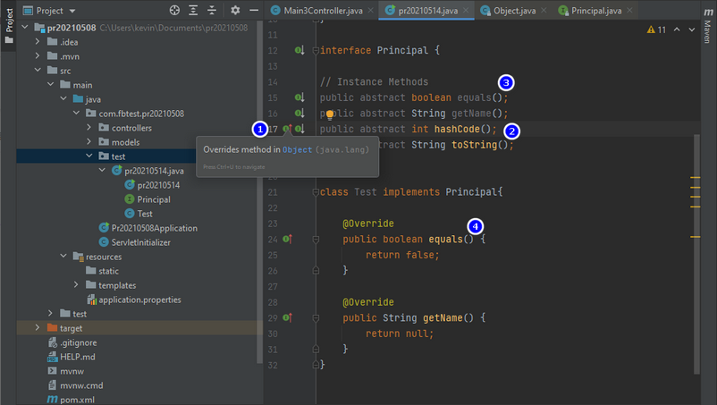

- see 1,3 declared in Object => no need to be implemented

- see 2,4 declared in Object => need to be implemented


<hr>

# IllegalArgumentException:  declares multiple JSON fields named name

```java
package com.fbtest.pr20210602.test_Extend_Gson;

import com.google.gson.Gson;

public class MainTest {

    public static void main(String[] args) {
        TestP test = new TestC();
        System.out.println(new Gson().toJson(test));
    }
}

class TestP{
    private String name = "Test 1-1";
    private String id = "id101";

    public String getName() {
        return name;
    }

    public void setName(String name) {
        this.name = name;
    }

    public String getId() {
        return id;
    }

    public void setId(String id) {
        this.id = id;
    }
}

class TestC extends TestP{
    private String name = "Test 2-1";
    private String id = "id201";
}
```

```
Exception in thread "main" java.lang.IllegalArgumentException: class com.fbtest.pr20210602.test_Extend_Gson.TestC declares multiple JSON fields named name
	at com.google.gson.internal.bind.ReflectiveTypeAdapterFactory.getBoundFields(ReflectiveTypeAdapterFactory.java:172)
	at com.google.gson.internal.bind.ReflectiveTypeAdapterFactory.create(ReflectiveTypeAdapterFactory.java:102)
	at com.google.gson.Gson.getAdapter(Gson.java:458)
	at com.google.gson.Gson.toJson(Gson.java:696)
	at com.google.gson.Gson.toJson(Gson.java:683)
	at com.google.gson.Gson.toJson(Gson.java:638)
	at com.google.gson.Gson.toJson(Gson.java:618)
	at com.fbtest.pr20210602.test_Extend_Gson.MainTest.main(MainTest.java:9)

Process finished with exit code 1
```
## example2

```java
class TestP{
    protected String name = "Test 1-1";
    protected String id = "id101";

class TestC extends TestP{
    protected String name = "Test 2-1";
    protected String id = "id201";
```

```
Exception in thread "main" java.lang.IllegalArgumentException: class com.fbtest.pr20210602.test_Extend_Gson.TestC declares multiple JSON fields named name
```

## Solution ```Constructor```

```java
class TestP{
    protected String name = "Test 1-1";
    protected String id = "id101";
    ...
}

class TestC extends TestP{

    public TestC() {
        this.name = "Test 2-1";
        this.id = "id201";
    }
}
```


- if use transient

```java
class TestC extends TestP{
    protected transient String name = "Test 2-1";
    protected transient String id = "id201";
}
```

### output

```
{"name":"Test 1-1","id":"id101"}
```