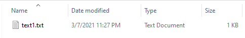
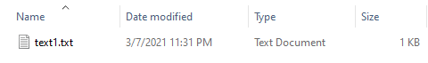

## Hashing Algorithms

|||
|---|---|
|MD5|128 bit|
|SHA|||
|SHA-1|160 bit|
|SHA-256|256 bit|
|SHA-512|512 bit|
|HMAC|MD5+SHA|

<br>

## WIN cmd

```cmd
CertUtil [Options] -hashfile InFile [HashAlgorithm]
```

### [HashAlgorithm]:

||||
|---|---|---|
|MD2|MD4|MD5|
|SHA1|SHA256|SHA384|
|SHA512|||

<br>

### MD5

#### keytool_test:

```cmd
C:\Users\kevin\Desktop\keytool_test>CertUtil -hashfile text1.txt MD5
MD5 hash of text1.txt:
b10a8db164e0754105b7a99be72e3fe5
CertUtil: -hashfile command completed successfully.
```

#### keytool_test2 ( Different Date modified ):

```cmd
C:\Users\kevin\Desktop\keytool_test2>CertUtil -hashfile text1.txt MD5
MD5 hash of text1.txt:
b10a8db164e0754105b7a99be72e3fe5
CertUtil: -hashfile command completed successfully.
```





#### MD5 hash of 2021-03-07_233602.png:

```cmd
C:\Users\kevin\Desktop\keytool_test>CertUtil -hashfile 2021-03-07_233602.png MD5
MD5 hash of 2021-03-07_233602.png:
8e440daa6e8044e9054cf63ed23a04db
CertUtil: -hashfile command completed successfully.
```

#### MD5 hash of 2021-03-07_233602_2.png:

```cmd
C:\Users\kevin\Desktop\keytool_test>CertUtil -hashfile 2021-03-07_233602_2.png MD5
MD5 hash of 2021-03-07_233602_2.png:
b39ec474db6f332c27540e5761e5bba4
CertUtil: -hashfile command completed successfully.
```

<br>

### SHA256

```cmd
C:\Users\kevin\Desktop\keytool_test>CertUtil -hashfile text1.txt SHA256
SHA256 hash of text1.txt:
a591a6d40bf420404a011733cfb7b190d62c65bf0bcda32b57b277d9ad9f146e
CertUtil: -hashfile command completed successfully.
```

### CertUtil Usage:
```cmd
Usage:
  CertUtil [Options] -hashfile InFile [HashAlgorithm]
  Generate and display cryptographic hash over a file

Options:
  -Unicode          -- Write redirected output in Unicode
  -gmt              -- Display times as GMT
  -seconds          -- Display times with seconds and milliseconds
  -v                -- Verbose operation
  -privatekey       -- Display password and private key data
  -pin PIN                  -- Smart Card PIN
  -sid WELL_KNOWN_SID_TYPE  -- Numeric SID
            22 -- Local System
            23 -- Local Service
            24 -- Network Service

Hash algorithms: MD2 MD4 MD5 SHA1 SHA256 SHA384 SHA512
```

## Java SHA-256 

```java
public class Ch10_4 {

	public static void main(String[] args) throws NoSuchAlgorithmException {
		MessageDigest alg = MessageDigest.getInstance("SHA-256");
        // MD2 MD5
        // SHA SHA-224 SHA-256
        // SHA-384 SHA-512
		byte[] hash = alg.digest("123456".getBytes());
		for (int i = 0; i < hash.length; i++){
      System.out.printf("%02X ", hash[i] & 0xFF);
    }
		System.out.println();
	}
}
```

```java
import java.security.MessageDigest;
import java.security.NoSuchAlgorithmException;
```