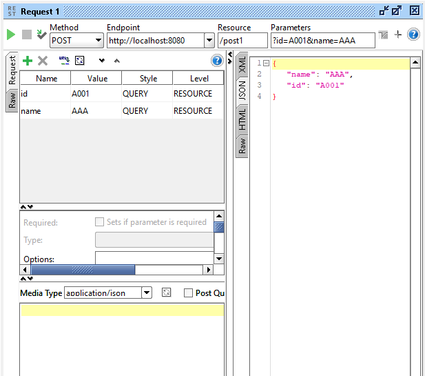
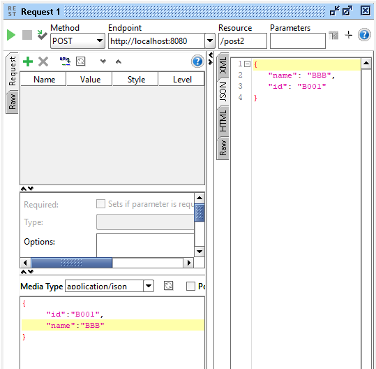
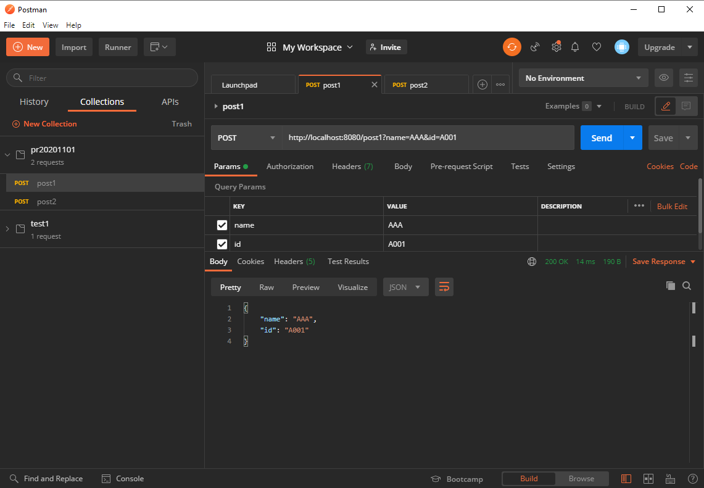
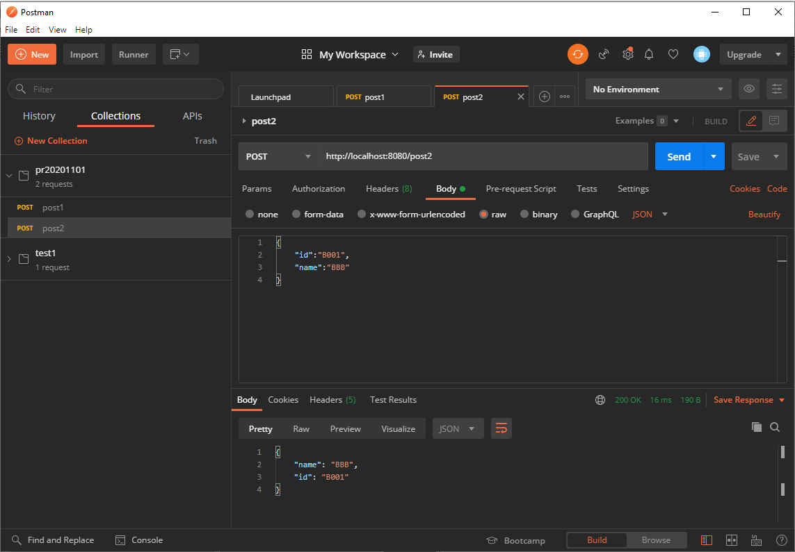

## RequestParam

```java
import org.springframework.web.bind.annotation.PostMapping;
import org.springframework.web.bind.annotation.RequestBody;
import org.springframework.web.bind.annotation.RequestParam;
import org.springframework.web.bind.annotation.RestController;

import com.google.gson.Gson;
import com.google.gson.JsonElement;
import com.google.gson.JsonObject;

@RestController
public class MainRestController { ... }
```

### Server
```java
	@PostMapping("/post1")
	public Client post1(
			@RequestParam ("name") String name
			,@RequestParam ("id") String id) {
		Client client = new Client();
		client.setName(name);
		client.setId(id);
		return client;
	}
```

### Client
```java
import com.google.gson.Gson;

public class Client1 {
	public static void main(String[] args) {
		RestTemplate restTemplate = new RestTemplate();
		
		HttpHeaders headers = new HttpHeaders();
		headers.setContentType(MediaType.APPLICATION_FORM_URLENCODED);
		
		MultiValueMap<String, String> map=
             new LinkedMultiValueMap<String, String>();
		map.add("name", "BBB");
		map.add("id", "B0001");
		HttpEntity<MultiValueMap<String, String>> request = 
            new HttpEntity<MultiValueMap<String, String>>(map, headers);

		String urlstr = "http://localhost:8080/post1";
		String a = restTemplate.postForObject(urlstr, request, String.class);
		System.out.println(a);
	}
}
```

## RequestBody (Request Payload)
```java
	@PostMapping("/post2")
	public Client post2(@RequestBody String payload) {
		Client client = new Client();
		
		JsonObject jsonOb = new Gson().fromJson(payload, JsonObject.class);
		
		JsonElement nameOp = jsonOb.get("name");
		JsonElement idOp = jsonOb.get("id");
		if(nameOp != null) {
			client.setName(nameOp.getAsString());
		}
		if(idOp != null) {
			client.setId(idOp.getAsString());
		}
		return client;
	}
```

### Client

```java
import java.util.HashMap;
import java.util.Map;

import org.springframework.http.HttpEntity;
import org.springframework.http.HttpHeaders;
import org.springframework.http.MediaType;
import org.springframework.web.client.RestTemplate;

import com.google.gson.Gson;

public class Client2 {

	public static void main(String[] args) {
		RestTemplate restTemplate = new RestTemplate();
		Map<String,String> reqMap = new HashMap<>();
		reqMap.put("name", "AAA");
//		reqMap.put("id", "A1234"); // null test
		String requestBodyStr = new Gson().toJson(reqMap);

		HttpHeaders headers = new HttpHeaders();
		headers.setContentType(MediaType.APPLICATION_JSON);
		
		HttpEntity<String> request = new HttpEntity<>(requestBodyStr,headers);

		String urlstr = "http://localhost:8080/post2";
		String a = restTemplate.postForObject(urlstr, request, String.class);
		System.out.println(a);

	}

}

```

### Entity
```java
class Client{
	private String name;
	private String id;
	public String getName() {
		return name;
	}
	public String getId() {
		return id;
	}
	public void setName(String name) {
		this.name = name;
	}
	public void setId(String id) {
		this.id = id;
	}
	
}
```

## SoapUI




## Postman




<br>

## also see:
[How are parameters sent in an HTTP POST request?](https://stackoverflow.com/questions/14551194/how-are-parameters-sent-in-an-http-post-request)