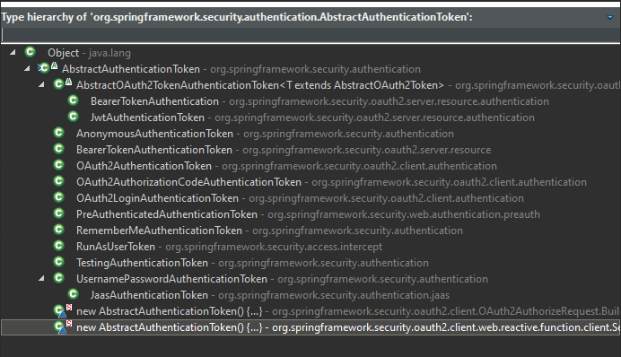

```java
return new UsernamePasswordAuthenticationToken(username, password, new ArrayList<>());
```

```java
public class UsernamePasswordAuthenticationToken extends AbstractAuthenticationToken
```



- [Doc: Class AbstractAuthenticationToken](https://docs.spring.io/spring-security/site/docs/current/api/org/springframework/security/authentication/AbstractAuthenticationToken.html)