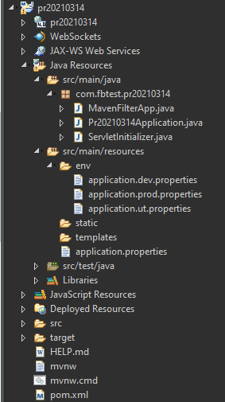
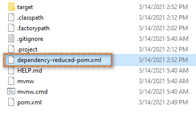
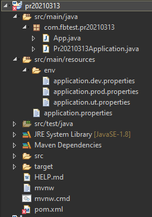

# Maven Package Test

## WAR




### Java

```java
package com.fbtest.pr20210314;

import java.io.IOException;
import java.io.InputStream;
import java.util.Properties;

public class MavenFilterApp {

	public static void main(String[] args) {

		MavenFilterApp app = new MavenFilterApp();
        Properties prop = app.loadPropertiesFile("application.properties");
        prop.forEach((k, v) -> System.out.println(k + ":" + v));

    }
	
    public Properties loadPropertiesFile(String filePath) {

        Properties prop = new Properties();

        try (InputStream resourceAsStream = getClass().getClassLoader().getResourceAsStream(filePath)) {
            prop.load(resourceAsStream);
        } catch (IOException e) {
            System.err.println("Unable to load properties file : " + filePath);
        }

        return prop;

    }
}
```

### pom.xml

```xml
<?xml version="1.0" encoding="UTF-8"?>
<project xmlns="http://maven.apache.org/POM/4.0.0" xmlns:xsi="http://www.w3.org/2001/XMLSchema-instance"
	xsi:schemaLocation="http://maven.apache.org/POM/4.0.0 https://maven.apache.org/xsd/maven-4.0.0.xsd">
	<modelVersion>4.0.0</modelVersion>
	<parent>
		<groupId>org.springframework.boot</groupId>
		<artifactId>spring-boot-starter-parent</artifactId>
		<version>2.4.3</version>
		<relativePath/> <!-- lookup parent from repository -->
	</parent>
	<groupId>com.fbtest</groupId>
	<artifactId>pr20210314</artifactId>
	<version>0.0.1-SNAPSHOT</version>
	<packaging>war</packaging>
	<name>pr20210314</name>
	
	<!-- maven-shade-plugin -->
	<profiles>
        <profile>
            <id>dev</id>
            <activation>
                <activeByDefault>true</activeByDefault>
            </activation>
            <properties>
                <env>dev</env>
            </properties>
        </profile>
        <profile>
            <id>prod</id>
            <properties>
                <env>prod</env>
            </properties>
        </profile>
        <profile>
            <id>ut</id>
            <properties>
                <env>ut</env>
            </properties>
        </profile>
    </profiles>
	<!-- maven-shade-plugin -->
	
	<description>Maven Multi-property Test</description>
	<properties>
		<java.version>1.8</java.version>
	</properties>
	<dependencies>
		<dependency>
			<groupId>org.springframework.boot</groupId>
			<artifactId>spring-boot-starter-web</artifactId>
		</dependency>

		<dependency>
			<groupId>org.springframework.boot</groupId>
			<artifactId>spring-boot-starter-tomcat</artifactId>
			<scope>provided</scope>
		</dependency>
		<dependency>
			<groupId>org.springframework.boot</groupId>
			<artifactId>spring-boot-starter-test</artifactId>
			<scope>test</scope>
		</dependency>
	</dependencies>

	<build>
		<!-- maven-shade-plugin -->
		<filters>
            <filter>src/main/resources/env/application.${env}.properties</filter>
        </filters>
        <resources>
            <resource>
                <directory>src/main/resources</directory>
                <filtering>true</filtering>
                <includes>
                    <include>*.properties</include>
                </includes>
            </resource>
        </resources>
		<!-- maven-shade-plugin -->
		<finalName>${project.artifactId}</finalName>
		<plugins>
			<plugin>
				<groupId>org.springframework.boot</groupId>
				<artifactId>spring-boot-maven-plugin</artifactId>
			</plugin>
			
			<!-- maven-shade-plugin -->
			<plugin>
                <groupId>org.apache.maven.plugins</groupId>
                <artifactId>maven-shade-plugin</artifactId>
                <executions>
                    <execution>
                    	<id>dev</id>
                        <phase>package</phase>
                        <goals>
                            <goal>shade</goal>
                        </goals>
                        <configuration>
                            <transformers>
                                <transformer implementation="org.apache.maven.plugins.shade.resource.ManifestResourceTransformer">
                                    <mainClass>com.fbtest.pr20210314.MavenFilterApp</mainClass>
                                </transformer>
                            </transformers>
                        </configuration>
                    </execution>
                </executions>
            </plugin>
            <!-- maven-shade-plugin -->
            
		</plugins>
	</build>

</project>
```

### application.properties

Spring-boot: ```@env@```<br>
others: ```${env}```

```
env=@env@
```

### env/application.dev.properties

```
env=dev
```

### env/application.dev.properties

```
env=dev
```

### env/application.prod.properties

```
env=prod
```
<br>

## CMD:

- package ut

```cmd
C:\Users\kevin\eclipse-workspace-ibm\pr20210314>mvn package -P ut
```


- Add ```dependency-reduced-pom.xml``` after packaging

<br>

## clean target
```cmd
C:\Users\kevin\eclipse-workspace-ibm\pr20210314>mvn clean
```

<hr>

## JAR



```java
package com.fbtest.pr20210313;

import java.io.IOException;
import java.io.InputStream;
import java.util.Properties;


public class App {

	public static void main(String[] args) {

		App app = new App();
        Properties prop = app.loadPropertiesFile("application.properties");
        prop.forEach((k, v) -> System.out.println(k + ":" + v));

    }
	
    public Properties loadPropertiesFile(String filePath) {

        Properties prop = new Properties();

        try (InputStream resourceAsStream = getClass().getClassLoader().getResourceAsStream(filePath)) {
            prop.load(resourceAsStream);
        } catch (IOException e) {
            System.err.println("Unable to load properties file : " + filePath);
        }

        return prop;

    }
}
```

### pom.xml

```xml
<?xml version="1.0" encoding="UTF-8"?>
<project xmlns="http://maven.apache.org/POM/4.0.0" xmlns:xsi="http://www.w3.org/2001/XMLSchema-instance"
	xsi:schemaLocation="http://maven.apache.org/POM/4.0.0 https://maven.apache.org/xsd/maven-4.0.0.xsd">
	<modelVersion>4.0.0</modelVersion>
	<parent>
		<groupId>org.springframework.boot</groupId>
		<artifactId>spring-boot-starter-parent</artifactId>
		<version>2.4.3</version>
		<relativePath/> <!-- lookup parent from repository -->
	</parent>
	<groupId>com.fbtest</groupId>
	<artifactId>pr20210313</artifactId>
	<profiles>
        <profile>
            <id>dev</id>
            <activation>
                <activeByDefault>true</activeByDefault>
            </activation>
            <properties>
                <env>dev</env>
            </properties>
        </profile>

        <profile>
            <id>prod</id>
            <properties>
                <env>prod</env>
            </properties>
        </profile>

        <profile>
            <id>ut</id>
            <properties>
                <env>ut</env>
            </properties>
        </profile>
    </profiles>
    
<!-- 	<version>0.0.1-SNAPSHOT</version> -->
	<name>pr20210313</name>
	<description>Maven Multi-property Test</description>
	<properties>
		<java.version>1.8</java.version>
	</properties>
	<dependencies>
		<dependency>
			<groupId>org.springframework.boot</groupId>
			<artifactId>spring-boot-starter</artifactId>
		</dependency>

		<dependency>
			<groupId>org.springframework.boot</groupId>
			<artifactId>spring-boot-starter-test</artifactId>
			<scope>test</scope>
		</dependency>
	</dependencies>

	<build>
        <filters>
            <filter>src/main/resources/env/application.${env}.properties</filter>
        </filters>
        <resources>
            <resource>
                <directory>src/main/resources</directory>
                <filtering>true</filtering>
                <includes>
                    <include>*.properties</include>
                </includes>
            </resource>
        </resources>
		<plugins>
			<plugin>
				<groupId>org.springframework.boot</groupId>
				<artifactId>spring-boot-maven-plugin</artifactId>
			</plugin>
      		<plugin>
                <groupId>org.apache.maven.plugins</groupId>
                <artifactId>maven-shade-plugin</artifactId>
                <executions>
                    <execution>
                    	<id>dev</id>
                        <phase>package</phase>
                        <goals>
                            <goal>shade</goal>
                        </goals>
                        <configuration>
                            <transformers>
                                <transformer
                                        implementation="org.apache.maven.plugins.shade.resource.ManifestResourceTransformer">
                                    <mainClass>com.fbtest.pr20210313.App</mainClass>
                                </transformer>
                            </transformers>
                        </configuration>
                    </execution>
                </executions>
            </plugin>
        </plugins>
	</build>
</project>

```

### application.properties

```
env=@env@
```

### env/application.dev.properties

```
env=dev
```

### env/application.dev.properties

```
env=dev
```

### env/application.prod.properties

```
env=prod
```

<hr>
<br>

# Reference:

- [maven-profiles-example](https://mkyong.com/maven/maven-profiles-example/)
- [三個簡單類型的maven-ear專案做法](https://tzuyichao.wordpress.com/2016/08/27/三個簡單類型的maven-ear專案做法/)