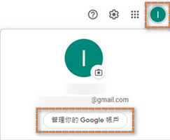
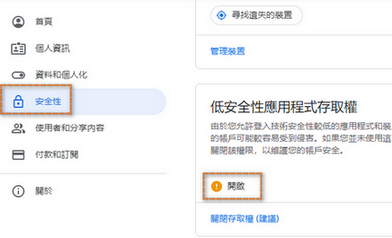

## Enable Gmail

# References:
- [Github Example](https://github.com/thymeleaf/thymeleafexamples-springmail)

- [Sending email in Spring with Thymeleaf](https://www.thymeleaf.org/doc/articles/springmail.html)

- Pivotal Certified Professional Core Spring 5 Developer Exam