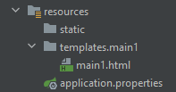
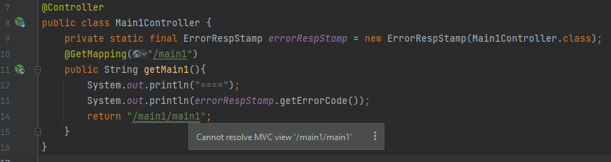
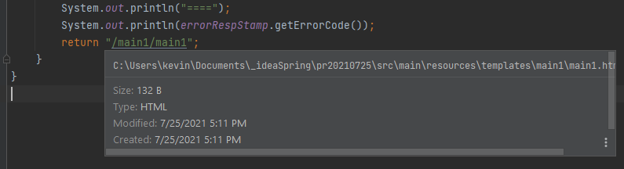

# Cannot resolve MVC view /<br> There was an unexpected error (type=Not Found, status=404).
 




## solution:
> add thymeleaf in pom.xml

```xml
<dependency>
    <groupId>org.springframework.boot</groupId>
    <artifactId>spring-boot-starter-thymeleaf</artifactId>
</dependency>
```

